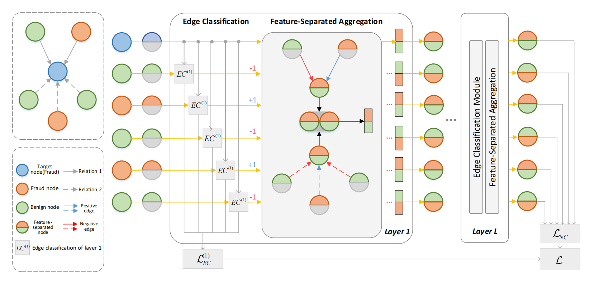

# FSGNN



# Dependencies

- Python >= 3.8
- numpy >= 1.22.4
- scipy >= 1.4.1
- scikit-learn >= 1.1.2
- [PyTorch](https://pytorch.org/) >= 1.11.0
- [DGL](https://www.dgl.ai/) >= 0.9.1

# Usage

- ```src/```: includes all code scripts.
- ```data/```: includes original datasets:
  - ```FDCompCN.zip```: The processed dataset of FDCompCN, which contains financial statement fraud of companies in China from CSMAR database.
- ```config/```: includes the setting of parameters for the dataset.
  - ```comp.yaml```: The general parameters of FDCompCN.
- ```result/```: includes the trained models.
  - ```comp.pt```: The trained model for FDCompCN.

# Model Training

```python
# Unzip the dataset
upzip ./data/FDCompCN.zip ./data/

# Move to src/
cd src/

# Convert the original dataset to dgl graph
# The generated dgl graph contains the features, graph structure and edge labels.
python data_preprocess.py --dataset FDCompCN

# Train and test the dataset
# If you want to change the parameters in training process, you can modify the corresponding yaml file in config.
python train.py --dataset FDCompCN
```

We also provide trained models in ```result``` directory to reproduce the results.

```python
# Load the model to predict
model_path = '../result/comp.pt'
model = torch.load(model_path)
```

# Run on your Datasets

To run FSGNN on your datasets, you need to prepare the following data:

- A homogeneous or multi-relation graph
- Node labels
- Node features

Transform the data into DGL format using the code in data_preprocess.py as a reference.
